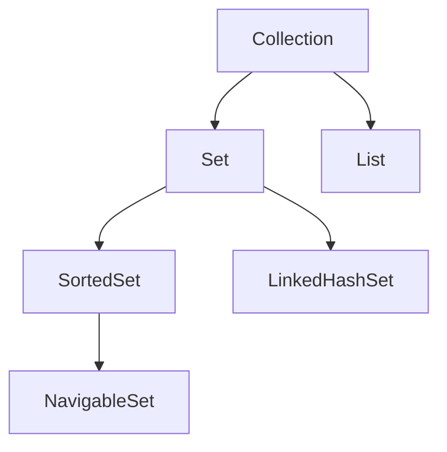
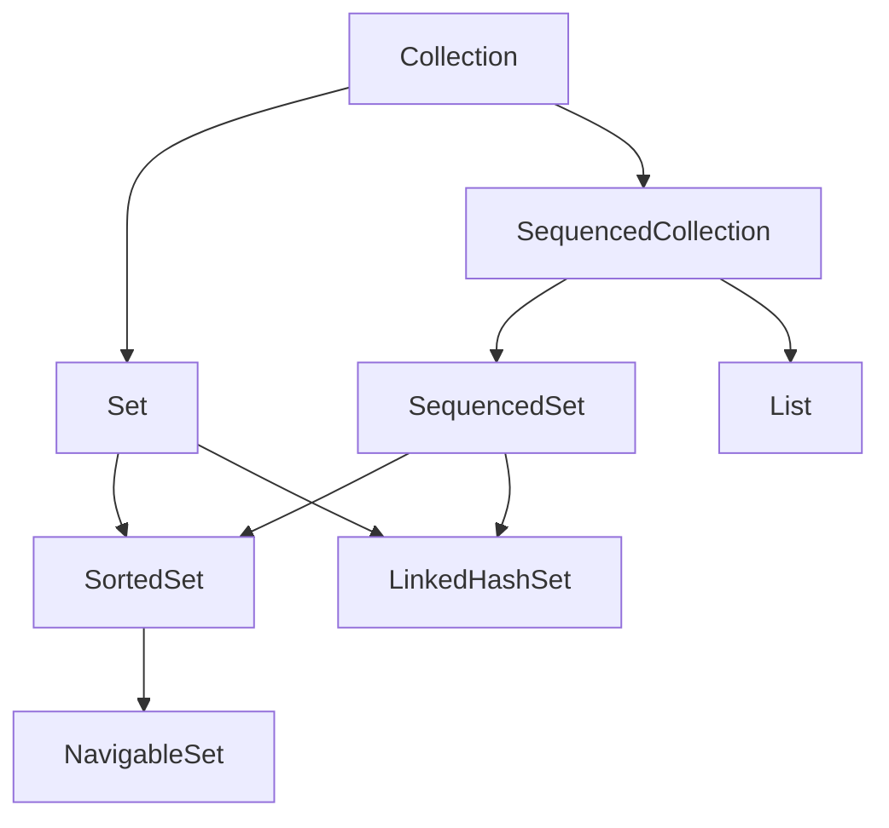
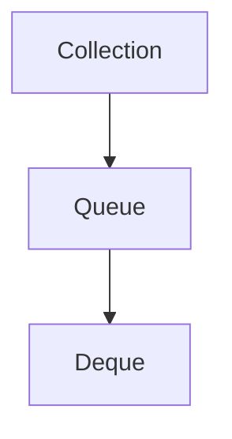
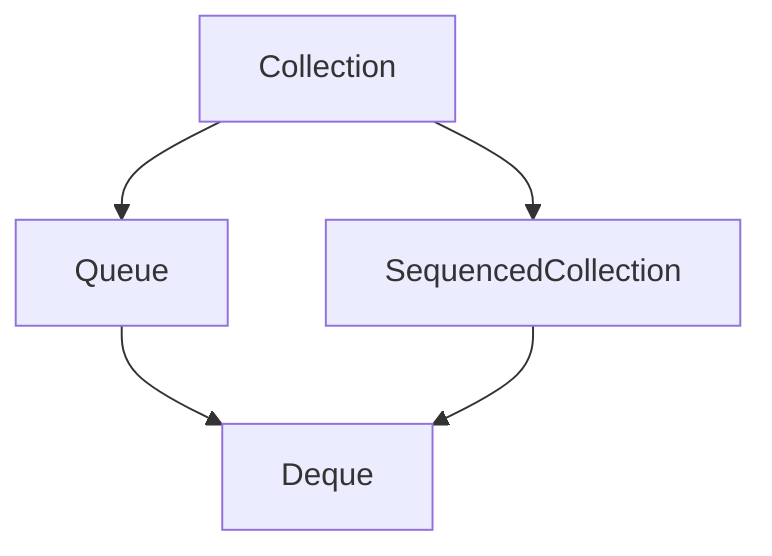

# Java New Features exploration

### Regular expression use of named groups
- The named group is represented as `?<name>` as the first element of the grp definition
```java
String line = "1;New York;8 336 817";
Pattern pattern = Pattern.compile("""
              (?<index>\\d+);\
              (?<city>[ a-zA-Z]+);\
              (?<population>[ \\d]+)$
""");

Matcher matcher = pattern.matcher(pattern);
if(matcher.matches(line)){
  var index = matcher.group("index");
  var city = matcher.group("city");
  var population = matcher.group("population");
}


```

### SequencedCollection, SequencedSet and SequencedMap
- Collection interface had 2 child interfaces, Set and List
- List maintains the insertion(encounter) order of elements
- Set ensures there are no dupes
- SortedSet extends Set and maintains the elements in sorted order
- Sorted order means use of a comparator.This comparator can be embedded into the objects in the case of Comparable or it can be an external Comparator
- We cannot add an element at a certain location within a sortedset, neither get or remove(we can get/remove it with iterators, but not with index)
- Ordering elements means each element has an index, where we can add at an index, remove from index and get from index
- Encounter order: Order in which an iterator will iterate over the elements in the collection
- LinkedHashSet is another impl of set , that guarantees uniqueness, and has few properties of list, but not all of them, which prevents it from implementing java.util.List
- There was nothing in the Collection api so far to model this shared behaviour
- SequnecedCollection have now been introduced to bridge the gap between orderedCollections and sortedCollections
- New behaviour added: getting, adding, remving from the start and end of collection as well as collection reversal

- Before Java21 : List extends Collection
- in Java21: List extends SequencedCollection extends Collection
- in Java21: SortedSet extends Set, SequencedSet


|  Operation | before 21 | In 21|
| ------------- | ------------- |---|
| get first element|get(0) |getFirst()|
| remove first element| remove(0)| removeFirst()|
|add first element| add(0,elem)| addFirst(elem)|
| get last element| get(list.size()-1) | getLast()|
| remove las element| remove(list.size()-1)| removeLast()|
| add last element| add(elem)| add(elem)/ addLast(elem)|
| reverse collection| Collections.reverse(list)| list.reversed()|


- Collection hierarchy before Java 21



- Collection hierarchy from Java 21


- Queue Hierarchy before Java 21


- Queue Hierarchy from Java 21



### Addition of creation methods to collections API
```java
var map = HashMap.newHashMap(100);
var set = HashSet.newHashSet(100);
var linkedMap = LinkedHashMap.newLinkedHashMap(100);
var linkedSet = LinkedHashSet.newLinkedHashSet(100);
```

### Autocloseable for several java classes
- HttpClient
- ExecutorService
- ForkJoinPool
- Autocloseable is a very nifty method that helps u close a resource once it is not needed
- It has a single close() method
- We can use a try-with resources only if that class implements AutoCloseable
- When we reach the end of this try-with block, the resource will close no matter what
```java
class MyConnection implements AutoCloseable {
   void close(){
     // close the resources that are no longer needed
   }
}

try(var conn = new MyConnection()){
  // do something with connection
}
```

### Thread API changes
- The Thread class sleep and join now support methods that take in a Duration object
- New methods to create threads
- New method in exec service to create V threads, these threads are created on the fly and not pooled
```java
void sleep(Duration duration);
void join(Duration duration);
boolean isVirtual();

Thread.ofPlatform();
Thread.ofVirtual();
var executor = Executors.newVirtualThreadPerTaskExecutor();
```

### Deprecated APIs
- finalize() method
- new constructors on wrapper classes like new Integer(num)-> Integer.valueOf(num) in preparation of value types from the valhalla project

### Sealed interfaces and pattern matching
```java
    sealed interface Interest permits CompoundInterest,SimpleInterest{}

    record CompoundInterest(int noOfYears) implements Interest{}

    record SimpleInterest(double fixedRate) implements Interest{}


    sealed interface Loan permits SecuredLoan,UnsecuredLoan {}

    record SecuredLoan(SimpleInterest simpleInterest) implements Loan{}

    record UnsecuredLoan(double interest, Interest interestType) implements Loan{}

    Loan l = new UnsecuredLoan(1.2d,new CompoundInterest(10));
        switch (l){
            case SecuredLoan sl -> System.out.println("loan is " + sl);
            case UnsecuredLoan(double interest, SimpleInterest abc) -> System.out.println("loan interest is " + interest + " and simpl type is " + abc);
            case UnsecuredLoan(double interest, CompoundInterest abc) -> System.out.println("loan interest is " + interest + " and comp type is " + abc);
        }
```

### Records
- It is a final class that extends java.lang.Record and no other class/record can extend from a record
- It can implement interfaces
- It can be created either thru the canonical constructor (ueing new(a,b..)) or a compact constructor
- We can also add more constructors, but at the end of the day, these constructors must call the canonical constructor
```java
record Range(int start, int end){
  Range{ // compact constructor
    if(start > end){ // will ensure that only valid records are created 
      throw new IllegalStateException();
    }
  }
}


```
